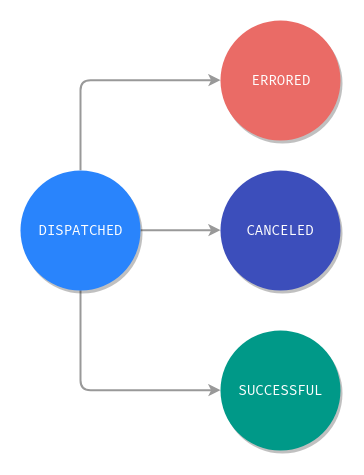
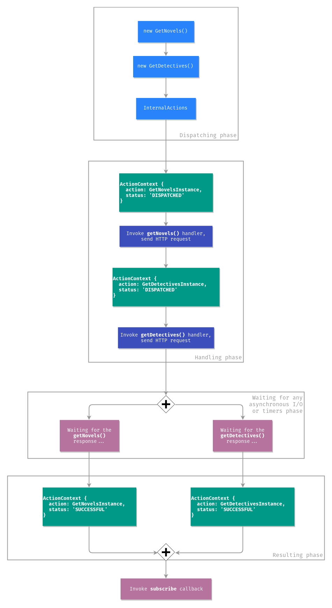

# 动作的生命周期

本文档介绍了动作的生命周期，阅读该文档后，您应该对NGXS如何处理动作以及它们处于什么阶段有更好的了解。

## 理论

NGXS中的任何动作都可以处于四个状态之一，这些状态为`DISPATCHED`, `SUCCESSFUL`, `ERRORED`, `CANCELED`，可以将其视为有限状态机。

* DISPATCHED: 已调度
* SUCCESSFUL: 成功
* ERRORED: 错误
* CANCELED: 已取消



NGXS具有内部动作流。 当我们使用以下代码调度任何操作时：

```typescript
store.dispatch(new GetNovels());
```

内部动作流发出一个名为 `ActionContext` 的对象，该对象具有2个属性：

```typescript
{
  action: GetNovelsInstance,
  status: 'DISPATCHED'
}
```

有一个动作流侦听器，可以通过 `DISPATCHED` 状态过滤动作并为该动作调用适当的处理程序。 在完成对动作的所有处理后，它将生成一个具有`status`值的新 `ActionContext` ：

```typescript
{
  action: GetNovelsInstance,
  status: 'SUCCESSFUL'
}
```

然后，在“成功”处理动作之后，触发由 `dispatch` 方法返回的可观察对象，并且，响应于该可观察对象，您可以在操作完成后执行想要执行的操作。

如果 `GetNovels` 处理程序抛出错误，例如：

```typescript
@Action(GetNovels)
getNovels() {
  throw new Error('This is just a simple error!');
}
```

然后将创建以下 `ActionContext` ：

```typescript
{
  action: GetNovelsInstance,
  status: 'ERRORED'
}
```

操作可以是同步的，也可以是异步的，例如，如果您向API发送请求并等待响应，则这些操作可以是同步的。 异步动作是并行处理的，同步动作是一个接一个地处理的。

那“已取消”状态呢？ 只能取消异步动作，这意味着新动作是在前一个动作处理程序完成某些异步工作之前调度的。 取消动作可以通过向 `@Action` 装饰器提供选项来实现：

```typescript
export class NovelsState {
  constructor(private novelsService: NovelsService) {}

  @Action(GetNovels, { cancelUncompleted: true })
  getNovels(ctx: StateContext<Novel[]>) {
    return this.novelsService.getNovels().pipe(
      tap(novels => {
        ctx.setState(novels);
      })
    );
  }
}
```

想象一下，有一个组件，它上面有一个按钮，该按钮在单击时调度 `GetNovels` 动作：

```typescript
@Component({
  selector: 'app-novels',
  template: `
    <app-novel *ngFor="let novel of novels$ | async" [novel]="novel"></app-novel>
    <button (click)="getNovels()">Get novels</button>
  `
})
export class NovelsComponent {
  @Select(NovelsState) novels$: Observable<Novel[]>;

  constructor(private store: Store) {}

  getNovels() {
    this.store.dispatch(new GetNovels());
  }
}
```

如果您单击按钮两次，则将调度两个动作，而上一个动作将被取消，因为它是异步的。 这和 `switchMap` 完全一样。 如果我们不使用NGXS，则代码如下所示：

```typescript
@Component({
  selector: 'app-novels',
  template: `
    <app-novel *ngFor="let novel of novels" [novel]="novel"></app-novel>
    <button #button>Get novels</button>
  `
})
export class NovelsComponent implements OnInit {
  @ViewChild('button', { static: true }) button: ElementRef<HTMLButtonElement>;

  novels: Novel[] = [];

  constructor(private novelsService: NovelsService) {}

  ngOnInit() {
    fromEvent(this.button.nativeElement, 'click')
      .pipe(switchMap(() => this.novelsService.getNovels()))
      .subscribe(novels => {
        this.novels = novels;
      });
  }
}
```

## 异步动作

让来我们讨论异步操作更多的内容，想象一个简单的状态，该状态存储不同类型的书籍并具有以下代码：

```typescript
export interface BooksStateModel {
  novels: Book[];
  detectives: Book[];
}

export class GetNovels {
  static type = '[Books] Get novels';
}

export class GetDetectives {
  static type = '[Books] Get detectives';
}

@State<BooksStateModel>({
  name: 'books',
  defaults: {
    novels: [],
    detectives: []
  }
})
@Injectable()
export class BooksState {
  constructor(private booksService: BooksService) {}

  @Action(GetNovels)
  getNovels(ctx: StateContext<BooksStateModel>) {
    return this.booksService.getNovels().pipe(
      tap(novels => {
        ctx.patchState({ novels });
      })
    );
  }

  @Action(GetDetectives)
  getDetectives(ctx: StateContext<BooksStateModel>) {
    return this.booksService.getDetectives().pipe(
      tap(detectives => {
        ctx.patchState({ detectives });
      })
    );
  }
}
```

假设您分别分派 `GetNovels` 和 `GetDetectives` 动作，如下所示：

```typescript
store
  .dispatch(new GetNovels())
  .subscribe(() => {
    ...
  });

store
  .dispatch(new GetDetectives())
  .subscribe(() => {
    ...
  });
```

您可以正确地假设对 `GetNovels` 的请求将在 `GetDetectives` 之前调度。 由于调度的同步性质，这是正确的，但是它们的动作处理程序是异步的，因此您无法确定哪个HTTP响应将首先返回。 在这个例子中，我们在 `GetDetectives` 之前调度 `GetNovels` 动作，但是如果调用小说的调用花费了更长的时间，那么 `novels` 属性将在 `detectives` 之后设置。 `store.dispatch`  函数返回一个observable，可用于响应每个动作的完成。

或者，您可以调度一个动作数组：

```typescript
store
  .dispatch([
    new GetNovels(),
    new GetDetectives()
  ])
  .subscribe(() => {
    ...
  });
```

分发的顺序与前面的示例相同，但是在此代码中，我们能够从 `store.dispatch` 函数中订阅一个可观察对象，该函数仅在两个动作均完成时才会触发。 下图演示了如何在后台处理异步操作：



## 生命周期的错误

那么，在这方面如何处理错误？ 假设您像这样同时调度多个动作：

```typescript
store
  .dispatch([
    new GetNovelById(id), // action handler throws `new Error(...)`
    new GetDetectiveById(id)
  ])
  .subscribe(
    () => {
      // they will never see me
    },
    error => {
      console.log(error); // `Error` that was thrown by the `getNovelById` handler
    }
  );
```

因为至少有一个动作会引发错误，所以NGXS会将错误返回到 `onError` 可观察回调，并且不会调用 `onNext` 或 `onComplete` 回调。

## 异步操作仍在继续 - "Fire and forget" vs "Fire and wait"

在NGXS中，当您进行异步工作时，您应该从表示该异步工作\(和完成情况\)的`@Action`方法中返回一个`Observable`或 `Promise` 。 然后，动作的完成将与异步工作的完成联系在一起。 如果您使用JavaScript语法 `async/await`，NGXS将知道完成情况，因为 `async`方法会为您返回`Promise`。 如果您返回`Observable`，NGXS将为您订阅可观察的观察，并将操作的完成生命周期事件绑定到`Observable`的完成。

有时，您可能不希望动作的完成等待异步工作完成。 这就是我们所说的"fire and forget"。 只需要`@Action`方法不将句柄返回到方法异步工作即可实现。 请注意，在这里对于`Observable`，您将必须进行`.toPromise()`或调用 `.toPromise()` 来确保可观察的运行。

`Observable` version:

```typescript
@Action(GetNovels)
getNovels(ctx: StateContext<BooksStateModel>) {
  this.booksService.getNovels().subscribe(novels => {
    ctx.patchState({ novels });
  });
}
```

`Promise` version:

```typescript
@Action(GetNovels)
getNovels(ctx: StateContext<BooksStateModel>) {
  this.booksService.getNovels().toPromise()
    .then(novels => {
      ctx.patchState({ novels });
    });
}
```

使用"fire and forget"方法的另一个更常见的用例是，当您在处理程序里不想等待“子”动作完成就调度新动作。 例如，如果我们想在小说之后立即加载侦探，但又不想等到`GetNovels`动作完成后再加载侦探，那么我们将有以下代码：

```typescript
export class BooksState {
  constructor(private booksService: BooksService) {}

  @Action(GetNovels)
  getNovels(ctx: StateContext<BooksStateModel>) {
    return this.booksService.getNovels().pipe(
      tap(novels => {
        ctx.patchState({ novels });
        ctx.dispatch(new GetDetectives());
      })
    );
  }

  @Action(GetDetectives)
  getDetectives(ctx: StateContext<BooksStateModel>) {
    return this.booksService.getDetectives().pipe(
      tap(detectives => {
        ctx.patchState({ detectives });
      })
    );
  }
}
```

在这里，`GetDetectives` 动作将在 `GetNovels` 动作完成之前被调度。 就 `GetNovels` 动作而言，`GetDetectives` 动作就是一个"fire and forget"。 需要明确的是，NGXS将等待来自 `GetNovels` 服务调用的响应，然后它将使用返回的小说填充新状态，然后将调度新的 `GetDetectives` 操作\(这将启动另一个异步请求\)。 ，然后 `GetNovels` 会进入其成功状态\(而不等待 `GetDetectives` 动作完成\)：

```typescript
store.dispatch(new GetNovels()).subscribe(() => {
  // they will see me, but detectives will be still loading in the background
});
```

如果您希望 `GetNovels` 操作等待 `GetDetectives` 操作完成，则必须使用 `mergeMap` 操作符\(或任何映射到内部`Observable`操作符的操作符，例如`concatMap`，`switchMap` ，例如`exhaustMap`\)，以便 `@Action`方法返回的 `Observable` 将其完成绑定到内部动作的完成：

```typescript
@Action(GetNovels)
getNovels(ctx: StateContext<BooksStateModel>) {
  return this.booksService.getNovels().pipe(
    tap(novels => {
      ctx.patchState({ novels });
    }),
    mergeMap(() => ctx.dispatch(new GetDetectives()))
  );
}
```

通常，将这类代码通过使用 `async/await` 语法转换为Promises来简化。 相同的方法如下：

```typescript
@Action(GetNovels)
async getNovels(ctx: StateContext<BooksStateModel>) {
  const novels = await this.booksService.getNovels().toPromise();
  ctx.patchState({ novels });
  await ctx.dispatch(new GetDetectives()).toPromise();
}
```

注意：如果在此处省略最后一个 `await` 关键字，则会再次使该关键字成为 "fire and forget"

## 总结

总之，任何已调度的动作都以状态 `DISPATCHED` 开始。 接下来，NGXS查找侦听此动作的处理程序（如果有）-NGXS调用它们并处理返回值和错误。 如果处理程序完成了一些工作并且没有引发错误，则操作的状态将更改为 `SUCCESSFUL` 。 如果在处理操作时出点问题\(例如，如果服务器返回了错误\)，则操作的状态将更改为`ERRORED`。 如果动作处理程序标记为 `cancelUncompleted`，并且在处理旧动作之前已经有新动作到达，则NGXS中断第一个动作的处理并将动作状态设置为 `CANCELED`。

