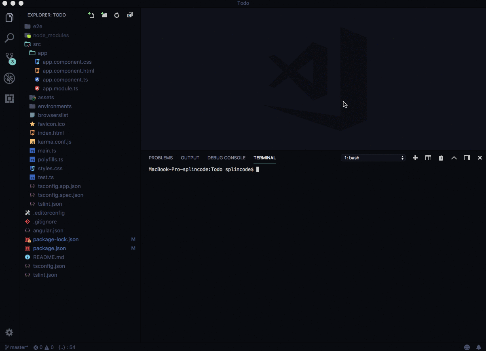

# CLI



## Install

The CLI can be installed using NPM:

```bash
npm install @ngxs/cli -g

# or if you use yarn
yarn global add @ngxs/cli
```

## Usage

```bash
ngxs
```

## Options \(silent\)

```bash
  ▓█▓▒▒▒▒▒▒▒▒▒▒██░   ▓█▒░░░░░░░░░░░░░  ░▒▒▒▒▒██░ ░██▒▒▒▒▒░  ░██▓▒▒▒▒▒▒▒▒▒▒▒▒░
 ░█░░██████████░░█  ░█░▒█████████████  ░█████░▒█ █▓░█████▒  ██ █████████████▓
 ░█ ▓█        █░░█  ░█ ▓▓                  ░█░▒█ █▓░█░      ██ █░
 ░█ ▓█        █░░█  ░█ ▓▓                  ░█░▒█░█▓░█░      ██ █░
 ░█ ▓█        █░░█  ░█ ▓▓   ░▓▓▓▓▓▓██      ░█░░▓▓▓░░█░      ▓█ ░▓▓▓▓▓▓▓▓▓███
 ░█ ▓█        █░░█  ░█ ▓▓   ░█████░░█      ░█░░███▒░█░       ▒████████████ █▒
 ░█ ▓█        █░░█  ░█ ▓▓       ░█░░█      ░█░▒█ █▓░█░                  ▓█ █▓
 ░█ ▓█        █░░█  ░█ ▓▓       ░█░░█      ░█░▒█ █▓░█░                  ▓█ █▓
 ░█ ▓█        █░░█  ░█░░█████████▓ ░█  ░████▓ ▓█ ██ ▓████▒  █████████████▒░█▒
 ░█ ▓█        █░░█   ░███████████████  ░██████▓   ▒██████▒  ███████████████░


NGXS CLI

  $ ngxs --name name --spec boolean --directory path --folder-name name
  $ ngxs --help

Options

  --name name         Store name
  --directory path    By default, the prompt is set to the current directory
  --folder-name name   Use your own folder name, default: state
  --spec boolean      Creates a spec file for store, default: true

Custom template generator

  --plopfile path   Path to the plopfile
```

### What is Plop?

[Plop](https://www.npmjs.com/package/plop) is what I like to call a "micro-generator framework." Now, I call it that because it is a small tool that gives you a simple way to generate code or any other type of flat text files in a consistent way. You see, we all create structures and patterns in our code \(routes, controllers, components, helpers, etc\). These patterns change and improve over time so when you need to create a NEW insert-name-of-pattern-here, it's not always easy to locate the files in your codebase that represent the current "best practice." That's where plop saves you. With plop, you have your "best practice" method of creating any given pattern in CODE. Code that can easily be run from the terminal by typing plop. Not only does this save you from hunting around in your codebase for the right files to copy, but it also turns "the right way" into "the easiest way" to make new files.

