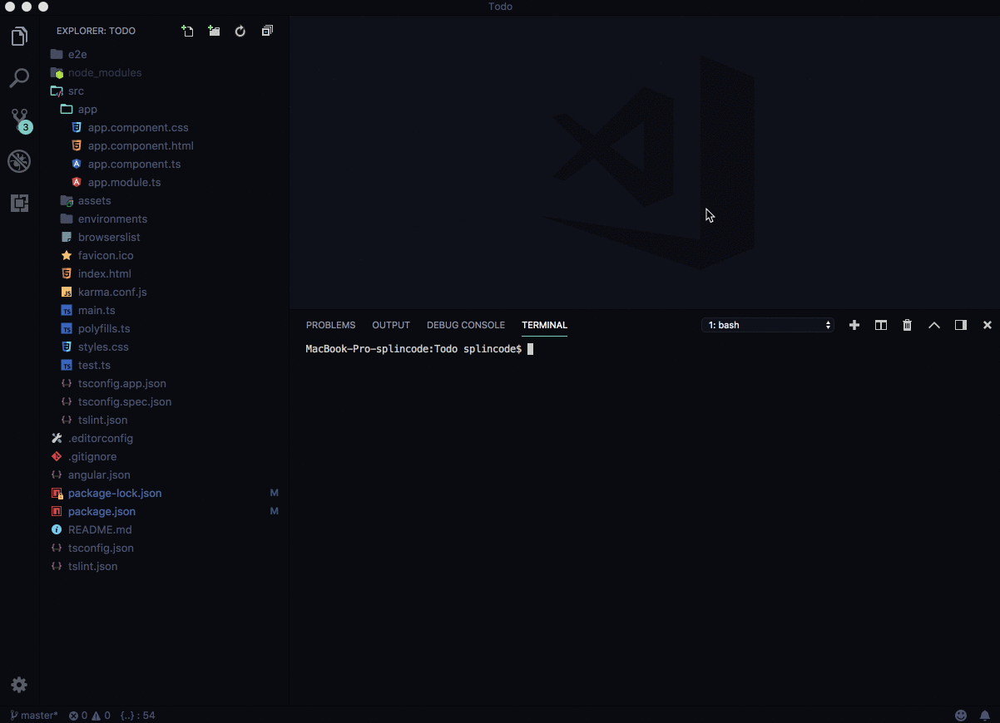

# CLI



## 安装

可以使用NPM安装CLI:

```bash
npm install @ngxs/cli -g

# 如果你更钟意yarn,也可以这样
yarn global add @ngxs/cli
```

## 用法

```bash
ngxs
```

## 选项 \(静默\)

```bash
  ▓█▓▒▒▒▒▒▒▒▒▒▒██░   ▓█▒░░░░░░░░░░░░░  ░▒▒▒▒▒██░ ░██▒▒▒▒▒░  ░██▓▒▒▒▒▒▒▒▒▒▒▒▒░
 ░█░░██████████░░█  ░█░▒█████████████  ░█████░▒█ █▓░█████▒  ██ █████████████▓
 ░█ ▓█        █░░█  ░█ ▓▓                  ░█░▒█ █▓░█░      ██ █░
 ░█ ▓█        █░░█  ░█ ▓▓                  ░█░▒█░█▓░█░      ██ █░
 ░█ ▓█        █░░█  ░█ ▓▓   ░▓▓▓▓▓▓██      ░█░░▓▓▓░░█░      ▓█ ░▓▓▓▓▓▓▓▓▓███
 ░█ ▓█        █░░█  ░█ ▓▓   ░█████░░█      ░█░░███▒░█░       ▒████████████ █▒
 ░█ ▓█        █░░█  ░█ ▓▓       ░█░░█      ░█░▒█ █▓░█░                  ▓█ █▓
 ░█ ▓█        █░░█  ░█ ▓▓       ░█░░█      ░█░▒█ █▓░█░                  ▓█ █▓
 ░█ ▓█        █░░█  ░█░░█████████▓ ░█  ░████▓ ▓█ ██ ▓████▒  █████████████▒░█▒
 ░█ ▓█        █░░█   ░███████████████  ░██████▓   ▒██████▒  ███████████████░


NGXS CLI

  $ ngxs --name name --spec boolean --directory path --folder-name name
  $ ngxs --help

Options

  --name name         Store name
  --directory path    By default, the prompt is set to the current directory
  --folder-name name   Use your own folder name, default: state
  --spec boolean      Creates a spec file for store, default: true

Custom template generator

  --plopfile path   Path to the plopfile
```

### Plop是啥?

[Plop](https://www.npmjs.com/package/plop) 我们将他称为“微型发电机框架”(micro-generator framework)。现在我称其为“小工具”，因为它为您提供了一种以一致的方式生成代码或任何其他类型的纯文本文件的简单方法。 您会发现，我们都在代码\(例如 routes, controllers, components, helpers\)中创建了结构和模式。 这些模式会随着时间的流逝而变化和改进，因此当您需要在此处创建新的模式插入名称时，在代码库中查找代表当前“最佳实践”的文件变得很困难，那么，是时候叫出Plop了。 使用plop，您可以使用“最佳实践”方法在CODE中创建任何给定的模式。可以通过输入plop轻松地从终端运行代码。 这不仅免于在代码库中四处寻找要复制的正确文件，而且还使“正确的方式”变成了“创建新文件的最简单的方式”。
