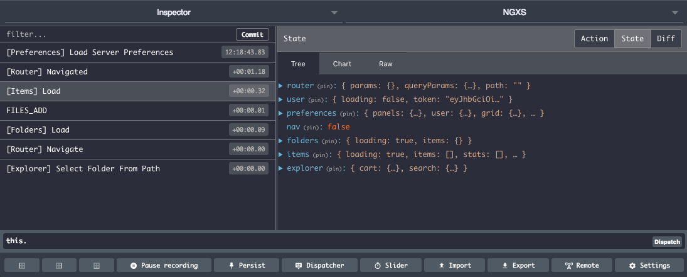

# Devtools

 [Redux Devtools extension](http://extension.remotedev.io/) 集成插件.



## 安装

```bash
npm install @ngxs/devtools-plugin --save-dev

# 用 yarn
yarn add @ngxs/devtools-plugin --dev
```

## 用法

将 `NgxsReduxDevtoolsPluginModule` 插件添加到您的根应用程序模块中：

```typescript
import { NgxsModule } from '@ngxs/store';
import { NgxsReduxDevtoolsPluginModule } from '@ngxs/devtools-plugin';

@NgModule({
  imports: [NgxsModule.forRoot([]), NgxsReduxDevtoolsPluginModule.forRoot()]
})
export class AppModule {}
```

### 选项

该插件支持以下通过 `forRoot` 方法传递的选项：

* `name`: 设置在Devtools中引用此存储实例的名称, \(默认：'NGXS'\)。
* `disabled`: 在生产环境禁用devtools
* `maxAge`: 保留的最大条目数。
* `actionSanitizer`: 在发送到开发工具之前重新格式化动作
* `stateSanitizer`: 发送到devtools之前重新格式化状态

### 注意事项

您应该始终将devtools作为配置中的最后一个插件。 例如，如果要在诸如存储插件之类的插件之前包含devtools，则初始状态将不会得到反映。

