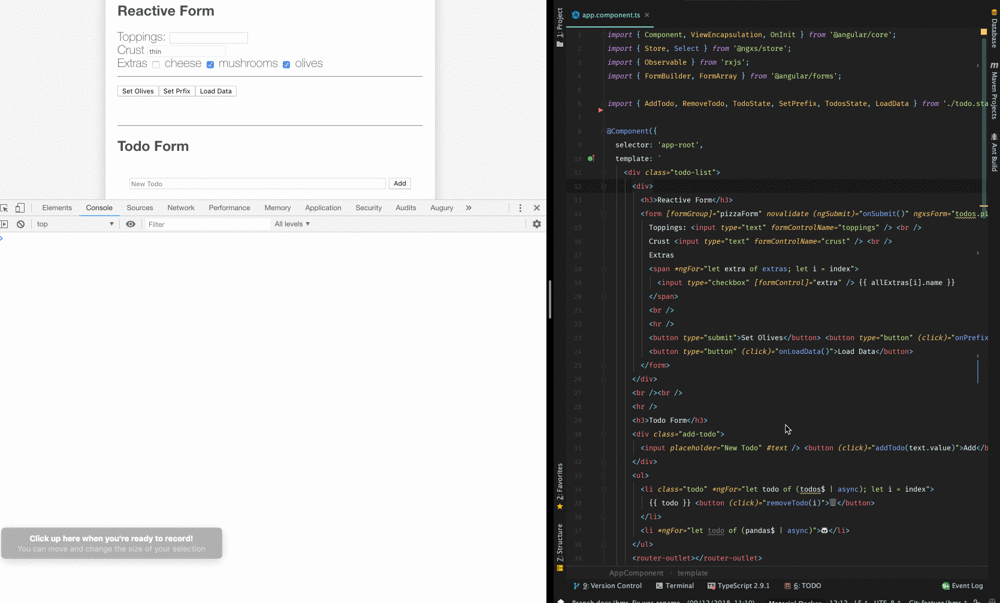

# HMR

热模块替换\(HMR\)是Webpack的一项功能，可以在运行的应用程序中更新代码，而无需重新构建它。 这样可以加快更新速度，减少整个页面的重新加载。 为了使HMR与Angular CLI一起使用，我们首先需要添加一个新环境并启用它。

## Add environment for HMR

在此步骤中，我们将配置Angular CLI环境，并定义启用HMR的环境。我们从在 `src/environments/` 目录中添加和更改文件开始。首先，我们创建一个名为`src/environments/environment.hmr.ts`的文件，其内容如下：

```typescript
export const environment = {
  production: false,
  hmr: true
};
```

更新`src/environments/environment.prod.ts`并在环境中添加hmr：false标志：

```typescript
export const environment = {
  production: true,
  hmr: false
};
```

Lastly we edit `src/environments/environment.ts` and change the environment to:

```typescript
export const environment = {
  production: false,
  hmr: false
};
```

更新angular.json来包含hmr环境（如此处所述），并在build中添加配置启用hmr。 请注意，此处表示要在angular.json中添加此配置的项目的名称。

```text
  "build": {
    "configurations": {
      ...
      "hmr": {
        "fileReplacements": [
          {
            "replace": "src/environments/environment.ts",
            "with": "src/environments/environment.hmr.ts"
          }
        ]
      }
    }
  },
  ...
  "serve": {
    "configurations": {
      ...
      "hmr": {
        "hmr": true,
        "browserTarget": "<project-name>:build:hmr"
      }
    }
  }
```

将必要的类型添加到`src/tsconfig.app.json`

```text
{
  ...
  "compilerOptions": {
    ...
    "types": ["node"]
  },
}
```

运行带有标志`--configuration hmr`的ng serve以启用hmr并选择新环境：

```bash
ng serve --configuration hmr
```

为此，请更新`package.json`并将其添加到脚本对象中，从而创建一个快捷方式：

```bash
"scripts": {
  ...
  "hmr": "ng serve --configuration hmr"
}
```

## 添加依赖关系并配置应用

为了使HMR正常工作，我们需要安装依赖项并配置我们的应用程序以使用它。

将`@ngxs/hmr-plugin`软件包安装到`dev-dependency`

更新`src/main.ts`以使用我们刚刚创建的文件：

```typescript
import { platformBrowserDynamic } from '@angular/platform-browser-dynamic';
import { enableProdMode, NgModuleRef } from '@angular/core';

import { AppModule } from './app/app.module';
import { environment } from './environments/environment';

if (environment.production) {
  enableProdMode();
}

const bootstrap = () => platformBrowserDynamic().bootstrapModule(AppModule);

if (environment.hmr) {
  import('@ngxs/hmr-plugin').then(plugin => {
    plugin.hmr(module, bootstrap).catch((err: Error) => console.error(err));
  });
} else {
  bootstrap().catch((err: Error) => console.log(err));
}
```

应该使用动态导入按需加载`@ngxs/hmr-plugin`，这样可以更容易地从摇树优化中受益。

## \(可选\) 更新`src/app/app.module.ts `以管理HMR生命周期中的状态：

```typescript
import { StateContext } from '@ngxs/store';
import { NgxsHmrLifeCycle, NgxsHmrSnapshot as Snapshot } from '@ngxs/hmr-plugin';

@NgModule({ .. })
export class AppBrowserModule implements NgxsHmrLifeCycle<Snapshot> {
  public hmrNgxsStoreOnInit(ctx: StateContext<Snapshot>, snapshot: Partial<Snapshot>) {
    ctx.patchState(snapshot);
  }

  public hmrNgxsStoreBeforeOnDestroy(ctx: StateContext<Snapshot>): Partial<Snapshot> {
    return ctx.getState();
  }
}
```

## 在启用HMR的情况下启动开发环境

现在已经完成了所有设置，我们可以运行新配置：

```bash
npm run hmr
```

Example:



启动服务器时，Webpack会告诉您它已启用：

```bash
NOTICE Hot Module Replacement (HMR) is enabled for the dev server.
```

现在，如果您对组件之一进行更改，则这些更改应该自动呈现，而无需刷新浏览器。

## HMR生命周期

如果要在hmr生命周期中对状态进行一些修改，则可以使用这些内置操作。 它们不会在生产中执行。

```typescript
import { HmrInitAction, HmrBeforeDestroyAction } from '@ngxs/hmr-plugin';

@State({ ... })
@Injectable()
export class MyState {
  @Action(HmrInitAction)
  public hmrInit(ctx: StateContext, { payload }) {
    ctx.setState({ ... })
  }

  @Action(HmrBeforeDestroyAction)
  public hrmBeforeDestroy(ctx: StateContext, { payload }) {
    ctx.setState({ ... })
  }
}
```

## HMR选项

提供以下选项：

* `autoClearLogs` - 每次刷新后清除日志\(默认为`true`\).
* `deferTime` - 加载旧状态之前的延迟时间 \(默认值为 `100` ms\);

```typescript
import('@ngxs/hmr-plugin').then(plugin => {
  plugin
    .hmr(module, bootstrap, {
      deferTime: 100,
      autoClearLogs: true
    })
    .catch((err: Error) => console.error(err));
});
```

## HMR实用程序

* `hmrIsReloaded` - 如果应用程序被热模块替换了至少一次或多次，则返回 `true` 。

例子:

```typescript
import { hmrIsReloaded } from '@ngxs/hmr-plugin';

@Component({})
class SomeComponent implements OnDestroy {
  ngOnDestroy(): void {
    if (hmrIsReloaded()) {
      return;
    }

    // heavy logic
  }
}
```

