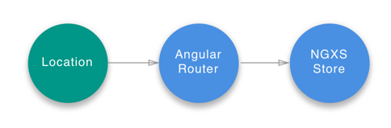

# Router



在浏览器中，位置\(URL信息\)和会话历史记录\(当前浏览器选项卡访问的位置的堆栈\)存储在全局窗口对象中。 可通过以下方式访问它们：

* `window.location` \([Location API](https://developer.mozilla.org/en-US/docs/Web/API/Location)\)
* `window.history` \([History API](https://developer.mozilla.org/en-US/docs/Web/API/History)\)


我们的位置数据是应用程序状态（属于存储的一种状态）的动态且重要的部分。 把它保存在存储中，我们使用devtools调试就像拥有了时间旅行器，可轻松从任何商店连接的组件进行访问。

该插件将该状态从Angular路由器绑定到我们的NGXS存储。

## 安装

```bash
npm install @ngxs/router-plugin --save

# or if you are using yarn
yarn add @ngxs/router-plugin
```

## 用法

将`NgxsRouterPluginModule`插件添加到您的根应用模块：

```typescript
import { NgxsModule } from '@ngxs/store';
import { NgxsRouterPluginModule } from '@ngxs/router-plugin';

@NgModule({
  imports: [NgxsModule.forRoot([]), NgxsRouterPluginModule.forRoot()]
})
export class AppModule {}
```

现在，该路由将以命名`router`的状态体现在的存储中。 该状态表示为一个`RouterStateSnapshot`对象。

您也可以使用存储的调度方法进行导航。 它接受以下参数：`new Navigate（path：any []，queryParams ?: Params，extras ?: NavigationExtras）`。 下面是一个导航至管理页面的简单例子：

```typescript
import { Store } from '@ngxs/store';
import { Navigate } from '@ngxs/router-plugin';

@Component({ ... })
export class MyApp {

  constructor(private store: Store) {}

  onClick() {
    this.store.dispatch(new Navigate(['/admin']))
  }

}
```

您可以通过订阅`RouterNavigation`, `RouterCancel`, `RouterError`或`RouterDataResolved`动作类，使用动作处理程序来侦听组件和服务中的状态更改。

## 侦听数据解析事件

当导航的路由进行链接的解析器时，您可以侦听它调度的 `RouterDataResolved` 动作。 例如：

```typescript
import { Actions, ofActionSuccessful } from '@ngxs/store';
import { RouterDataResolved } from '@ngxs/router-plugin';

import { Subject } from 'rxjs';
import { takeUntil } from 'rxjs/operators';

@Component({ ... })
export class AppComponent {

  private destroy$ = new Subject<void>();

  constructor(actions$: Actions) {
    actions$.pipe(
      ofActionSuccessful(RouterDataResolved),
      takeUntil(this.destroy$)
    ).subscribe((action: RouterDataResolved) => {
      console.log(action.routerState.root.firstChild.data);
    });
  }

  ngOnDestroy(): void {
    this.destroy$.next();
    this.destroy$.complete();
  }

}
```

更进一步，当我们需要绑定一些已解析数据的输入属性。 例如：

```typescript
import { Actions, ofActionSuccessful } from '@ngxs/store';
import { RouterDataResolved } from '@ngxs/router-plugin';

import { map } from 'rxjs/operators';

@Component({
  template: `
    <app-some-component [data]="data$ | async"></app-some-component>
  `
})
export class AppComponent {
  data$ = this.actions$.pipe(
    ofActionSuccessful(RouterDataResolved),
    map((action: RouterDataResolved) => action.routerState.root.firstChild.data)
  );

  constructor(private actions$: Actions) {}
}
```

## 自定义路由状态序列化器

您可以使用自己实现的路由状态序列化程序来序列化路由快照。

```typescript
import { Params, RouterStateSnapshot } from '@angular/router';

import { NgxsModule } from '@ngxs/store';
import { NgxsRouterPluginModule, RouterStateSerializer } from '@ngxs/router-plugin';

export interface RouterStateParams {
  url: string;
  params: Params;
  queryParams: Params;
}

// Map the router snapshot to { url, params, queryParams }
export class CustomRouterStateSerializer implements RouterStateSerializer<RouterStateParams> {
  serialize(routerState: RouterStateSnapshot): RouterStateParams {
    const {
      url,
      root: { queryParams }
    } = routerState;

    let { root: route } = routerState;
    while (route.firstChild) {
      route = route.firstChild;
    }

    const { params } = route;

    return { url, params, queryParams };
  }
}

@NgModule({
  imports: [NgxsModule.forRoot([]), NgxsRouterPluginModule.forRoot()],
  providers: [{ provide: RouterStateSerializer, useClass: CustomRouterStateSerializer }]
})
export class AppModule {}
```

