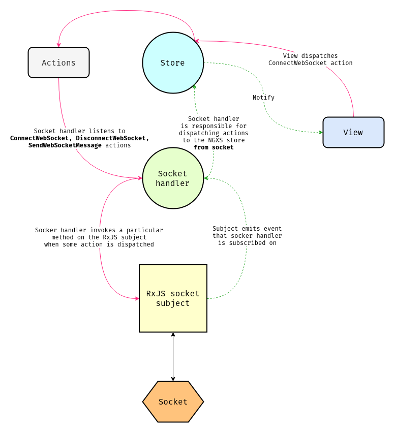

# Web Socket

将服务器Web套接字事件绑定到Ngxs存储操作。

## 安装

```bash
npm install @ngxs/websocket-plugin --save

# or if you are using yarn
yarn add @ngxs/websocket-plugin
```

## 配置

将`NgxsWebsocketPluginModule`插件添加到您的根应用程序模块中：

```typescript
import { NgxsModule } from '@ngxs/store';
import { NgxsWebsocketPluginModule } from '@ngxs/websocket-plugin';

@NgModule({
  imports: [
    NgxsModule.forRoot([]),
    NgxsWebsocketPluginModule.forRoot({
      url: 'ws://localhost:4200'
    })
  ]
})
export class AppModule {}
```

该插件具有多种可以传递的选项：

* `url`: Web套接字连接的网址。 可以在这里或通过`ConnectWebsocket`动作传递。
* `typeKey`: 将Web套接字消息映射到操作类型的对象属性。 默认值：`type`
* `serializer`: 将对象发送到Web套接字之前使用的序列化程序。 默认值: `JSON.stringify`
* `deserializer`: 用于从Web套接字收到的消息的反序列化器。 默认值: `JSON.parse`

## 用法

连接后，Web套接字上出现的任何消息都将绑定到状态事件流。

假设服务器端Web套接字以以下格式向客户端发送消息：

```javascript
{
  "type": "[Chat] Add message",
  "from": "Artur",
  "message": "Hello NGXS"
}
```

我们将要进行与此Web套接字消息相对应的操作，如下所示：

```typescript
export class AddMessage {
  static type = '[Chat] Add message';
  constructor(public from: string, public message: string) {}
}
```

假设我们有一些`messages`状态，我们在其中存储聊天消息：

```typescript
export interface Message {
  from: string;
  message: string;
}

@State<Message[]>({
  name: 'messages',
  defaults: []
})
@Injectable()
export class MessagesState {
  @Action(AddMessage)
  addMessage(ctx: StateContext<Message[]>, { from, message }: AddMessage) {
    const state = ctx.getState();
    // omit `type` property that server socket sends
    ctx.setState([...state, { from, message }]);
  }
}
```

我们可以通过调度带有效负载的 `SendWebSocketMessage` 来将消息发送到服务器。 让我们尝试一下：

```typescript
@Component({ ... })
export class AppComponent {

  constructor(private store: Store) {}

  sendMessage(from: string, message: string) {
    const event = new SendWebSocketMessage({
      type: 'message',
      from,
      message
    });

    this.store.dispatch(event);
  }

}
```

发送消息时，请记住发送接受JSON对象。 服务器端的套接字将侦听`message`事件。 例如，服务器代码可以如下：

```typescript
const { Server } = require('ws');
const { createServer } = require('http');

const app = require('express')();

const server = createServer(app);
const ws = new Server({ server });

server.listen(4200);

ws.on('connection', socket => {
  socket.on('message', data => {
    // That's the object that we passed into `SendWebSocketMessage` constructor
    const { type, from, message } = JSON.parse(data);

    if (type === 'message') {
      const event = JSON.stringify({
        type: '[Chat] Add message',
        from,
        message
      });

      // That's the same as `broadcast`
      // we want to send message to all connected
      // to the chat clients
      ws.clients.forEach(client => {
        client.send(event);
      });
    }
  });
});
```

请注意，您必须在服务器端指定 `type` 属性，否则将收到错误消息-`Type ... not found on message`。 如果您不想把`type`的属性名作为键名，可以在调用 `forRoot` 时指定自己的属性名称：

```typescript
NgxsWebsocketPluginModule.forRoot({
  url: 'ws://localhost:4200',
  typeKey: 'myAwesomeTypeKey'
});
```

In order to kick off our websockets we have to dispatch the `ConnectWebSocket` action. This will typically happen at startup or if you need to authenticate before, after authentication is done. You can optionally pass the URL here.

为了开始我们的网络套接字，我们必须调度`ConnectWebSocket`动作。 这通常会在启动时发生，或者如果您需要在身份验证完成之前进行身份验证，则会发生这种情况。 您可以选择在此处传递URL。

```typescript
@Component({ ... })
export class AppComponent {

  constructor(private store: Store) {}

  ngOnInit() {
    this.store.dispatch(new ConnectWebSocket());
  }

}
```

如果您在理解插件的工作方式时遇到困难，可以查看下面的数据流程图。 从一方面看，它似乎有点复杂，但不用担心。 只需遵循从视图开始到服务器端的粉红色数据流即可：




以下是您可以执行的所有动作的列表：

* `ConnectWebSocket`: 要初始化Web套接字时请调度此动作。 可以在此处传递URL（可选）。
* `DisconnectWebSocket`: 调度此动作来断开Web套接字的连接。
* `WebSocketConnected`: 连接Web套接字时调度的操作。
* `WebSocketDisconnected`: Web套接字断开连接时调度的动作。 使用其处理程序进行重新连接。
* `SendWebSocketMessage`: 向服务器发送消息。
* `WebsocketMessageError`: 收到消息时发生错误时，此插件调度的动作。
* `WebSocketConnectionUpdated`: 在现有连接之上创建新连接时，此插件调度的操作。 现有连接正在关闭。

In summary - your server-side sockets should send objects that have a `type` property \(or another key that you can provide in the `typeKey` property when calling `forRoot`\). This plugin will receive a message from the server and dispatch the message as an action with the corresponding `type` value. If the `type` property doesn't match any client-side `@Action` methods \(with an Action with the corresponding `static type` property value\) then no State will respond to the message.
总而言之——您的服务器端套接字应发送具有`type`属性\(或在调用`forRoot` 时可以在`typeKey`属性中提供的另一个键名\)的对象。  该插件将从服务器接收一条消息，并使用相应的 `type` 值将该消息作为动作进行调度。如果 `type` 属性与任何客户端 `@Action` 方法都不匹配\(带有具有相应 `static type` 属性值的动作\)，则没有状态会响应该消息。

